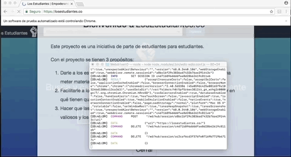

# E2E (End to End) Testing

https://miso-4208-labs.gitlab.io/talleres/taller2.html

Las pruebas E2E (end-to-end) permiten realizar pruebas desde la perspectiva del usuario. En este taller le daremos un vistazo a varios frameworks y librerías para correr este tipo de pruebas en aplicaciones WEB.

Pruebas realizadas al sitio: https://losestudiantes.co/

### 1. Cypress

  - Prueba crear cuenta:

  - Prueba ingreso de usuario registrado:

  - Prueba crear cuenta con usuario ya registrado:

  - Prueba búsqueda de profesores:

  - Prueba ir página principal del profesor:

  - Prueba filtros por matería en página del profesor:

### 2. Protractor

### 3. Webdriver.io

Crear cuenta:

Búscar profesor:

### 4. Nightwatch.js
